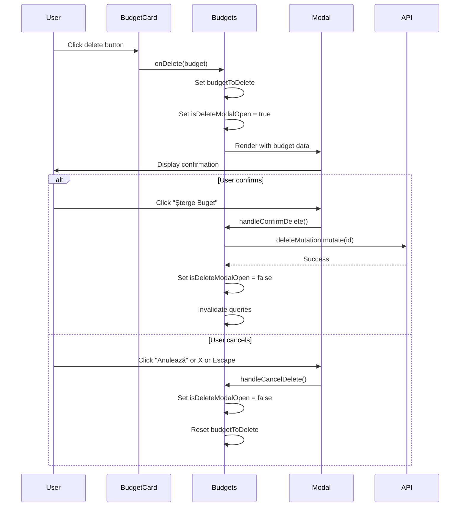

# Design Document: Budget Delete Confirmation Modal

## Overview

This design document outlines the technical implementation for replacing the native `window.confirm` dialog with a custom confirmation modal for budget deletion in the Sasha Finance application. The feature enhances user experience by providing a visually consistent, accessible, and informative confirmation dialog that aligns with the application's Electric Blue design system.

### Goals

- Replace native browser confirmation with custom modal component
- Display clear budget information before deletion
- Maintain consistent visual design with the application
- Ensure accessibility compliance (keyboard navigation, focus management)
- Preserve existing deletion functionality while improving UX

### Non-Goals

- Modifying the budget deletion API endpoint
- Adding undo functionality for deleted budgets
- Implementing bulk deletion of multiple budgets
- Changing the budget card layout or design

## Architecture

### Component Structure

The implementation follows a component-based architecture with clear separation of concerns:

```
Budgets Component (Container)
├── State Management
│   ├── isDeleteModalOpen: boolean
│   └── budgetToDelete: Budget | null
├── Event Handlers
│   ├── handleDeleteClick(budget: Budget)
│   ├── handleConfirmDelete()
│   └── handleCancelDelete()
└── Child Components
    ├── BudgetCard (existing)
    └── DeleteConfirmationModal (new inline component)
        ├── Modal (reusable UI component)
        ├── AlertTriangle icon
        ├── Budget details display
        └── Action buttons (Cancel, Delete)
```

### Data Flow



### State Management Strategy

The feature uses React's `useState` hooks for local component state management:

1. **Modal Visibility State**: `isDeleteModalOpen` controls whether the modal is rendered
2. **Budget Data State**: `budgetToDelete` stores the complete budget entity for display
3. **Mutation State**: Existing `deleteMutation` from React Query handles API calls and loading states

This approach maintains consistency with the existing Budgets component architecture and avoids introducing additional state management complexity.

## Components and Interfaces

### TypeScript Interfaces

```typescript
// Budget entity (existing type from shared package)
interface Budget {
  id: string;
  month: number;
  year: number;
  totalLimit: number;
  categories?: BudgetCategory[];
  isTotal?: boolean;
}

// Budget category (existing type)
interface BudgetCategory {
  id: string;
  categoryId: string;
  limitAmount: number;
  category?: Category;
}

// Delete modal props (inline component, no separate interface needed)
interface DeleteModalState {
  isOpen: boolean;
  budget: Budget | null;
}
```

### Component Modifications

#### 1. Budgets Component State Addition

```typescript
// Add to existing state declarations
const [isDeleteModalOpen, setIsDeleteModalOpen] = useState(false);
const [budgetToDelete, setBudgetToDelete] = useState<Budget | null>(null);
```

#### 2. Refactored handleDeleteClick

**Current Implementation (line 305-309):**
```typescript
const handleDeleteClick = (id: string) => {
  if (window.confirm('Sigur doriți să ștergeți acest buget?')) {
    deleteMutation.mutate(id);
  }
};
```

**New Implementation:**
```typescript
const handleDeleteClick = (budget: Budget) => {
  setBudgetToDelete(budget);
  setIsDeleteModalOpen(true);
};
```

**Key Changes:**
- Parameter changes from `id: string` to `budget: Budget` to capture full budget data
- Removes `window.confirm` call
- Sets modal state instead of immediately calling mutation

#### 3. New handleConfirmDelete Function

```typescript
const handleConfirmDelete = () => {
  if (budgetToDelete) {
    deleteMutation.mutate(budgetToDelete.id);
    setIsDeleteModalOpen(false);
    setBudgetToDelete(null);
  }
};
```

**Responsibilities:**
- Validates budgetToDelete exists
- Executes delete mutation with budget ID
- Closes modal immediately (optimistic UI)
- Resets budget state

#### 4. New handleCancelDelete Function

```typescript
const handleCancelDelete = () => {
  setIsDeleteModalOpen(false);
  setBudgetToDelete(null);
};
```

**Responsibilities:**
- Closes modal without executing deletion
- Resets budget state
- Called by Cancel button, X button, and Escape key

#### 5. BudgetCard Component Update

**Current onDelete prop (line 369):**
```typescript
onDelete={handleDeleteClick}
```

**Updated onDelete call (line 127):**
```typescript
<Button
  variant="ghost"
  onClick={() => onDelete(budget)} // Changed from onDelete(budget.id)
  style={{ padding: '0.5rem', minWidth: 'auto', color: '#ef4444' }}
>
  <Trash2 size={16} />
</Button>
```

**Key Changes:**
- Pass entire `budget` object instead of just `budget.id`
- Maintains existing button styling and icon

### Delete Confirmation Modal Component

The modal will be implemented as an inline JSX component within the Budgets component's return statement, positioned after the main content and before the closing div.

```typescript
{/* Delete Confirmation Modal */}
<Modal
  isOpen={isDeleteModalOpen}
  onClose={handleCancelDelete}
  title="Șterge Buget"
  footer={
    <>
      <Button
        variant="ghost"
        onClick={handleCancelDelete}
        disabled={deleteMutation.isPending}
      >
        Anulează
      </Button>
      <Button
        variant="danger"
        onClick={handleConfirmDelete}
        disabled={deleteMutation.isPending}
      >
        {deleteMutation.isPending ? 'Se șterge...' : 'Șterge Buget'}
      </Button>
    </>
  }
>
  {budgetToDelete && (
    <div style={{ display: 'flex', flexDirection: 'column', gap: '1rem' }}>
      {/* Warning Alert */}
      <div
        style={{
          display: 'flex',
          alignItems: 'flex-start',
          gap: '0.75rem',
          padding: '1rem',
          backgroundColor: 'rgba(245, 158, 11, 0.1)',
          border: '1px solid rgba(245, 158, 11, 0.3)',
          borderRadius: '0.5rem',
        }}
      >
        <AlertTriangle
          size={24}
          style={{ color: '#F59E0B', flexShrink: 0, marginTop: '0.125rem' }}
          aria-label="Avertizare"
        />
        <div style={{ flex: 1 }}>
          <p
            style={{
              margin: 0,
              color: tokens['text-primary'],
              fontWeight: 500,
              marginBottom: '0.25rem',
            }}
          >
            Sigur vrei să ștergi acest buget?
          </p>
          <p
            style={{
              margin: 0,
              color: tokens['text-muted'],
              fontSize: '0.875rem',
            }}
          >
            Această acțiune nu poate fi anulată.
          </p>
        </div>
      </div>

      {/* Budget Details */}
      <div
        style={{
          padding: '1rem',
          backgroundColor: tokens['bg-elevated'],
          border: `1px solid ${tokens['border-default']}`,
          borderRadius: '0.5rem',
        }}
      >
        <div style={{ marginBottom: '0.5rem' }}>
          <span style={{ color: tokens['text-muted'], fontSize: '0.875rem' }}>
            Perioadă:
          </span>
          <p
            style={{
              margin: '0.25rem 0 0 0',
              color: tokens['text-primary'],
              fontWeight: 600,
              fontSize: '1rem',
            }}
          >
            {getMonthName(budgetToDelete.month)} {budgetToDelete.year}
          </p>
        </div>
        <div>
          <span style={{ color: tokens['text-muted'], fontSize: '0.875rem' }}>
            Limită totală:
          </span>
          <p
            style={{
              margin: '0.25rem 0 0 0',
              color: tokens['text-primary'],
              fontWeight: 600,
              fontSize: '1rem',
            }}
          >
            {Number(budgetToDelete.totalLimit).toFixed(2)} RON
          </p>
        </div>
      </div>

      {/* Error Display */}
      {deleteMutation.isError && (
        <div
          style={{
            padding: '0.75rem 1rem',
            backgroundColor: tokens['accent-danger-soft'],
            border: `1px solid ${tokens['accent-danger']}`,
            borderRadius: '0.5rem',
            color: tokens['accent-danger'],
            fontSize: '0.875rem',
          }}
        >
          Eroare la ștergerea bugetului. Încearcă din nou.
        </div>
      )}
    </div>
  )}
</Modal>
```

## Data Models

### Existing Data Models (No Changes Required)

The feature uses existing data models from the shared package:

```typescript
// From @sasha-licenta/shared
interface Budget {
  id: string;
  month: number;        // 1-12
  year: number;         // e.g., 2024
  totalLimit: number;   // Decimal value
  categories?: BudgetCategory[];
  isTotal?: boolean;
  createdAt?: Date;
  updatedAt?: Date;
}
```

### State Models (New)

```typescript
// Modal state within Budgets component
type DeleteModalState = {
  isOpen: boolean;
  budgetToDelete: Budget | null;
};
```

### Helper Functions

```typescript
// Existing helper function (line 625-632)
function getMonthName(month: number): string {
  const months = [
    'Ianuarie', 'Februarie', 'Martie', 'Aprilie', 'Mai', 'Iunie',
    'Iulie', 'August', 'Septembrie', 'Octombrie', 'Noiembrie', 'Decembrie'
  ];
  return months[month - 1] || '';
}
```

**Usage**: Converts numeric month (1-12) to Romanian month name for display in modal.

## Error Handling

### Error Scenarios and Handling

#### 1. API Deletion Failure

**Scenario**: Backend returns error when attempting to delete budget

**Handling**:
```typescript
{deleteMutation.isError && (
  <div style={{
    padding: '0.75rem 1rem',
    backgroundColor: tokens['accent-danger-soft'],
    border: `1px solid ${tokens['accent-danger']}`,
    borderRadius: '0.5rem',
    color: tokens['accent-danger'],
    fontSize: '0.875rem',
  }}>
    Eroare la ștergerea bugetului. Încearcă din nou.
  </div>
)}
```

**Behavior**:
- Modal remains open to allow retry
- Error message displays below budget details
- User can retry deletion or cancel
- Uses design tokens for consistent error styling

#### 2. Network Timeout

**Scenario**: Request times out due to network issues

**Handling**: React Query's built-in error handling captures timeout errors and sets `deleteMutation.isError` to true, triggering the error display above.

#### 3. Invalid Budget State

**Scenario**: `budgetToDelete` is null when modal opens

**Prevention**:
```typescript
{budgetToDelete && (
  // Modal content only renders if budget exists
)}
```

**Behavior**: Modal body won't render if budget data is missing, preventing runtime errors.

#### 4. Concurrent Deletion Attempts

**Scenario**: User clicks delete button multiple times rapidly

**Prevention**:
```typescript
<Button
  variant="danger"
  onClick={handleConfirmDelete}
  disabled={deleteMutation.isPending}  // Prevents multiple clicks
>
  {deleteMutation.isPending ? 'Se șterge...' : 'Șterge Buget'}
</Button>
```

**Behavior**:
- Button disables during mutation
- Loading text provides feedback
- React Query prevents duplicate mutations

### Error Recovery

**User Actions**:
1. **Retry**: User can click "Șterge Buget" again after error
2. **Cancel**: User can close modal and try again later
3. **Refresh**: User can refresh page to reset state

**Automatic Recovery**:
- React Query automatically invalidates cache on success
- Component state resets on modal close
- No persistent error state between modal opens

## Testing Strategy

### Testing Approach

This feature involves UI interactions, state management, and API integration. Property-based testing is **not appropriate** for this feature because:

1. **UI Rendering**: Testing modal display and styling requires snapshot/visual tests
2. **Side Effects**: Deletion involves API calls and state mutations
3. **User Interactions**: Button clicks and keyboard events are specific scenarios
4. **Configuration**: Modal behavior is deterministic based on state

**Recommended Testing Strategy**: Unit tests for component logic + Integration tests for user flows

### Unit Tests

#### Test Suite 1: State Management

**File**: `frontend/src/features/budgets/Budgets.test.tsx`

```typescript
describe('Budget Delete Modal State Management', () => {
  test('should open modal when handleDeleteClick is called', () => {
    // Arrange: Render Budgets component
    // Act: Call handleDeleteClick with budget
    // Assert: isDeleteModalOpen is true, budgetToDelete is set
  });

  test('should close modal when handleCancelDelete is called', () => {
    // Arrange: Open modal with budget
    // Act: Call handleCancelDelete
    // Assert: isDeleteModalOpen is false, budgetToDelete is null
  });

  test('should reset state after successful deletion', () => {
    // Arrange: Open modal with budget
    // Act: Call handleConfirmDelete, mock successful mutation
    // Assert: Modal closes, state resets
  });

  test('should keep modal open after deletion error', () => {
    // Arrange: Open modal with budget
    // Act: Call handleConfirmDelete, mock failed mutation
    // Assert: Modal remains open, error displays
  });
});
```

#### Test Suite 2: Modal Content Display

```typescript
describe('Delete Confirmation Modal Content', () => {
  test('should display correct budget month and year', () => {
    // Arrange: Set budgetToDelete with specific month/year
    // Act: Render modal
    // Assert: Month name (Romanian) and year are displayed
  });

  test('should display formatted budget limit', () => {
    // Arrange: Set budgetToDelete with totalLimit
    // Act: Render modal
    // Assert: Limit displays as "X.XX RON"
  });

  test('should display AlertTriangle icon with correct styling', () => {
    // Arrange: Open modal
    // Act: Render modal
    // Assert: Icon present with warning color #F59E0B
  });

  test('should display error message when mutation fails', () => {
    // Arrange: Mock failed mutation
    // Act: Render modal
    // Assert: Error message displays with correct styling
  });
});
```

#### Test Suite 3: Button Interactions

```typescript
describe('Delete Modal Button Behavior', () => {
  test('should call handleCancelDelete when Cancel button clicked', () => {
    // Arrange: Render modal with mock handler
    // Act: Click "Anulează" button
    // Assert: handleCancelDelete called once
  });

  test('should call handleConfirmDelete when Delete button clicked', () => {
    // Arrange: Render modal with mock handler
    // Act: Click "Șterge Buget" button
    // Assert: handleConfirmDelete called once
  });

  test('should disable buttons during deletion', () => {
    // Arrange: Mock pending mutation
    // Act: Render modal
    // Assert: Both buttons are disabled
  });

  test('should show loading text during deletion', () => {
    // Arrange: Mock pending mutation
    // Act: Render modal
    // Assert: Button text is "Se șterge..."
  });
});
```

#### Test Suite 4: Accessibility

```typescript
describe('Delete Modal Accessibility', () => {
  test('should close modal when Escape key pressed', () => {
    // Arrange: Open modal
    // Act: Press Escape key
    // Assert: Modal closes
  });

  test('should trap focus within modal', () => {
    // Arrange: Open modal
    // Act: Tab through elements
    // Assert: Focus cycles within modal
  });

  test('should have aria-label on AlertTriangle icon', () => {
    // Arrange: Render modal
    // Act: Query icon
    // Assert: aria-label="Avertizare" present
  });

  test('should focus first interactive element on open', () => {
    // Arrange: Closed modal
    // Act: Open modal
    // Assert: Cancel button receives focus
  });
});
```

### Integration Tests

#### Test Suite 5: End-to-End Delete Flow

**File**: `frontend/src/features/budgets/Budgets.integration.test.tsx`

```typescript
describe('Budget Deletion Flow', () => {
  test('should complete full deletion flow successfully', async () => {
    // Arrange: Render Budgets with mock API
    // Act: 
    //   1. Click delete button on budget card
    //   2. Verify modal opens with correct data
    //   3. Click "Șterge Buget"
    //   4. Wait for API call
    // Assert: 
    //   - API called with correct budget ID
    //   - Modal closes
    //   - Budget removed from list
    //   - Success feedback shown
  });

  test('should handle deletion error gracefully', async () => {
    // Arrange: Render Budgets with failing mock API
    // Act:
    //   1. Click delete button
    //   2. Click "Șterge Buget"
    //   3. Wait for error
    // Assert:
    //   - Error message displays
    //   - Modal remains open
    //   - Budget still in list
    //   - Retry button enabled
  });

  test('should cancel deletion without API call', () => {
    // Arrange: Render Budgets
    // Act:
    //   1. Click delete button
    //   2. Click "Anulează"
    // Assert:
    //   - No API call made
    //   - Modal closes
    //   - Budget remains in list
  });
});
```

### Test Configuration

**Testing Libraries**:
- **Jest**: Test runner and assertion library
- **React Testing Library**: Component rendering and interaction
- **MSW (Mock Service Worker)**: API mocking for integration tests
- **@testing-library/user-event**: Realistic user interactions

**Coverage Goals**:
- **Unit Tests**: 90%+ coverage of component logic
- **Integration Tests**: All critical user paths covered
- **Accessibility**: All WCAG 2.1 AA requirements tested

### Manual Testing Checklist

- [ ] Modal opens when delete button clicked
- [ ] Correct budget information displays
- [ ] Cancel button closes modal without deletion
- [ ] Delete button triggers API call
- [ ] Loading state shows during deletion
- [ ] Success closes modal and removes budget
- [ ] Error displays and allows retry
- [ ] Escape key closes modal
- [ ] Click outside closes modal
- [ ] Tab navigation works correctly
- [ ] Screen reader announces modal content
- [ ] Visual design matches design tokens
- [ ] Works on mobile viewport
- [ ] Works in Chrome, Firefox, Safari

## Implementation Plan

### Phase 1: Component Refactoring (1-2 hours)

1. **Add State Variables**
   - Add `isDeleteModalOpen` state
   - Add `budgetToDelete` state
   - Location: After existing state declarations (~line 145)

2. **Refactor handleDeleteClick**
   - Change parameter from `id: string` to `budget: Budget`
   - Replace `window.confirm` with state updates
   - Location: Line 305-309

3. **Create New Handlers**
   - Implement `handleConfirmDelete`
   - Implement `handleCancelDelete`
   - Location: After `handleDeleteClick` (~line 310)

4. **Update BudgetCard Props**
   - Change `onDelete` call to pass full budget object
   - Location: Line 127 in BudgetCard component

### Phase 2: Modal Implementation (2-3 hours)

1. **Import Dependencies**
   - Add `AlertTriangle` from lucide-react
   - Import `tokens` from styles/colors
   - Location: Top of file with other imports

2. **Create Modal JSX**
   - Add modal component after main content
   - Implement warning alert section
   - Implement budget details section
   - Implement error display section
   - Location: Before closing `</div>` of budgets-container

3. **Style Modal Content**
   - Apply design tokens for colors
   - Implement responsive spacing
   - Add warning background styling
   - Location: Inline styles in modal JSX

### Phase 3: Testing (3-4 hours)

1. **Unit Tests**
   - Write state management tests
   - Write content display tests
   - Write button interaction tests
   - Write accessibility tests

2. **Integration Tests**
   - Write full deletion flow test
   - Write error handling test
   - Write cancellation test

3. **Manual Testing**
   - Test all user interactions
   - Test keyboard navigation
   - Test screen reader compatibility
   - Test responsive design

### Phase 4: Code Review & Refinement (1 hour)

1. **Code Quality**
   - Remove `window.confirm` references
   - Verify TypeScript types
   - Check for console errors
   - Verify no regressions

2. **Documentation**
   - Add JSDoc comments to new functions
   - Update component documentation
   - Document accessibility features

### Total Estimated Time: 7-10 hours

## Design Tokens Usage

### Color Tokens

```typescript
import { tokens } from '../../styles/colors';

// Background colors
tokens['bg-base']       // #0A0E1A - Main background
tokens['bg-surface']    // #131829 - Card background
tokens['bg-elevated']   // #1C2238 - Modal background

// Border colors
tokens['border-default'] // #252B42 - Default borders

// Text colors
tokens['text-primary']   // #E8EAF2 - Primary text
tokens['text-secondary'] // #B4BAC9 - Secondary text
tokens['text-muted']     // #8B92A8 - Muted text

// Accent colors
tokens['accent-danger']      // #FF5A6B - Danger button
tokens['accent-danger-soft'] // rgba(255, 90, 107, 0.15) - Error background
```

### Component-Specific Colors

```typescript
// Warning alert
backgroundColor: 'rgba(245, 158, 11, 0.1)'  // Warning background
borderColor: 'rgba(245, 158, 11, 0.3)'      // Warning border
iconColor: '#F59E0B'                         // Warning icon (AlertTriangle)
```

### Button Variants

```typescript
// Cancel button
variant="ghost"
// Uses: transparent background, text-secondary color

// Delete button
variant="danger"
// Uses: accent-danger-soft background, accent-danger color
```

## Accessibility Features

### Keyboard Navigation

1. **Tab Order**
   - Cancel button (first focusable)
   - Delete button (second focusable)
   - X close button (third focusable)

2. **Keyboard Shortcuts**
   - `Escape`: Close modal without deletion
   - `Tab`: Navigate forward through interactive elements
   - `Shift+Tab`: Navigate backward through interactive elements
   - `Enter`: Activate focused button

### Focus Management

```typescript
// Modal component handles focus trap automatically
// On modal open: Focus moves to first interactive element (Cancel button)
// On modal close: Focus returns to delete button that opened modal
```

### Screen Reader Support

1. **ARIA Labels**
   ```typescript
   <AlertTriangle aria-label="Avertizare" />
   ```

2. **Semantic HTML**
   - Modal uses proper heading hierarchy
   - Buttons use semantic `<button>` elements
   - Content uses semantic paragraph elements

3. **Live Regions**
   ```typescript
   // Error message should be announced
   {deleteMutation.isError && (
     <div role="alert" aria-live="polite">
       Eroare la ștergerea bugetului. Încearcă din nou.
     </div>
   )}
   ```

### Visual Accessibility

1. **Color Contrast**
   - Text on background: 7:1 ratio (WCAG AAA)
   - Button text: 4.5:1 ratio (WCAG AA)
   - Error text: 4.5:1 ratio (WCAG AA)

2. **Focus Indicators**
   - Visible focus ring on all interactive elements
   - 2px solid outline with accent-primary color
   - Provided by Button component

3. **Text Sizing**
   - Minimum 14px (0.875rem) for body text
   - Minimum 16px (1rem) for primary content
   - Scalable with browser zoom

## Migration Notes

### Breaking Changes

**None** - This is a non-breaking enhancement that replaces internal implementation without changing external API.

### Backward Compatibility

- Existing budget deletion functionality preserved
- API endpoints unchanged
- Data models unchanged
- Component props unchanged (except internal onDelete signature)

### Rollback Plan

If issues arise, rollback involves:

1. Revert `handleDeleteClick` to original implementation:
   ```typescript
   const handleDeleteClick = (id: string) => {
     if (window.confirm('Sigur doriți să ștergeți acest buget?')) {
       deleteMutation.mutate(id);
     }
   };
   ```

2. Remove modal state variables and JSX
3. Revert BudgetCard `onDelete` call to pass `budget.id`

### Deployment Considerations

- **No database migrations required**
- **No API changes required**
- **No environment variables required**
- **Frontend-only change** - can be deployed independently
- **No feature flags needed** - change is low-risk

## Future Enhancements

### Potential Improvements (Out of Scope)

1. **Undo Functionality**
   - Add "Undo" toast after deletion
   - Temporarily store deleted budget
   - Allow restoration within 5 seconds

2. **Bulk Deletion**
   - Add checkbox selection to budget cards
   - "Delete Selected" button
   - Confirmation modal shows count of budgets

3. **Deletion Confirmation Preference**
   - User setting to skip confirmation
   - "Don't ask again" checkbox
   - Stored in user preferences

4. **Audit Trail**
   - Log deletion events
   - Show "Deleted by" and timestamp
   - Admin view of deletion history

5. **Soft Delete**
   - Mark budgets as deleted instead of removing
   - Allow restoration from trash
   - Auto-purge after 30 days

## References

### Related Files

- `frontend/src/features/budgets/Budgets.tsx` - Main component to modify
- `frontend/src/components/ui/Modal.tsx` - Reusable modal component
- `frontend/src/components/ui/Button.tsx` - Reusable button component
- `frontend/src/styles/colors.ts` - Design token definitions
- `frontend/src/services/budgets.service.ts` - Budget API service

### Design System Documentation

- `frontend/DESIGN_TOKENS.md` - Design token usage guide
- `frontend/COLOR_SYSTEM.md` - Color system documentation
- `frontend/BUDGETS_REDESIGN.md` - Budgets feature design notes

### External Dependencies

- **React**: ^18.x - Component framework
- **React Query**: ^4.x - Data fetching and caching
- **lucide-react**: ^0.x - Icon library (AlertTriangle)
- **TypeScript**: ^5.x - Type safety

### WCAG Guidelines

- [WCAG 2.1 Level AA](https://www.w3.org/WAI/WCAG21/quickref/?versions=2.1&levels=aa)
- [Modal Dialog Pattern](https://www.w3.org/WAI/ARIA/apg/patterns/dialog-modal/)
- [Focus Management](https://www.w3.org/WAI/ARIA/apg/practices/keyboard-interface/)
