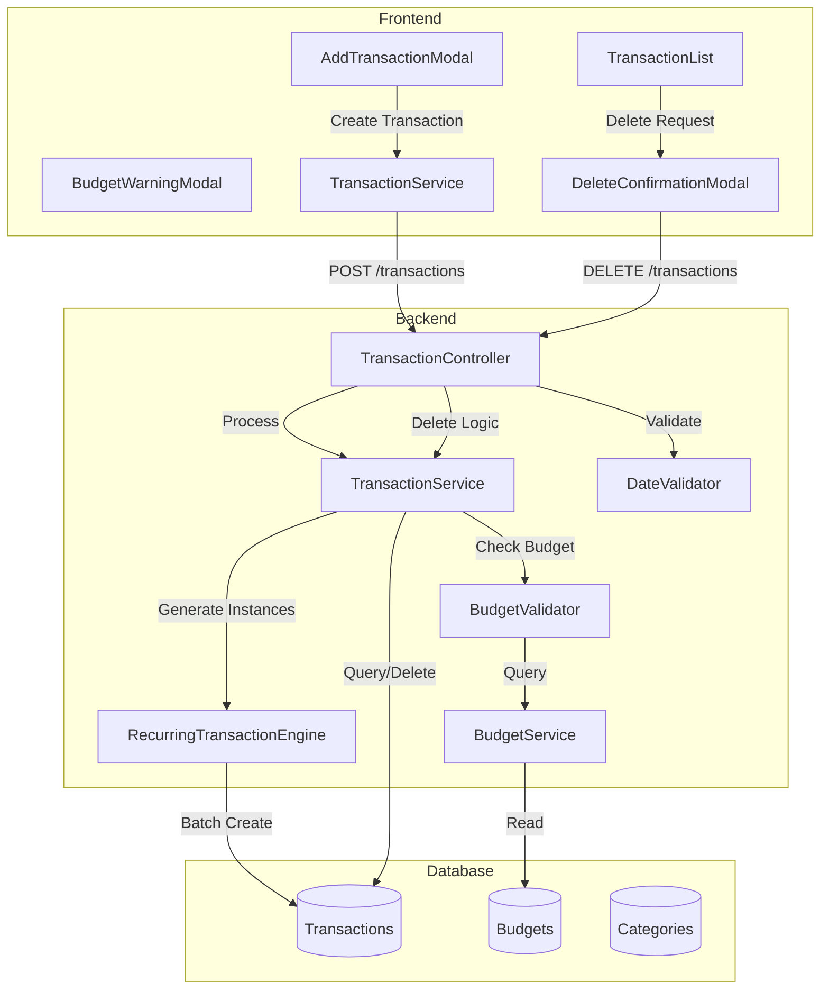
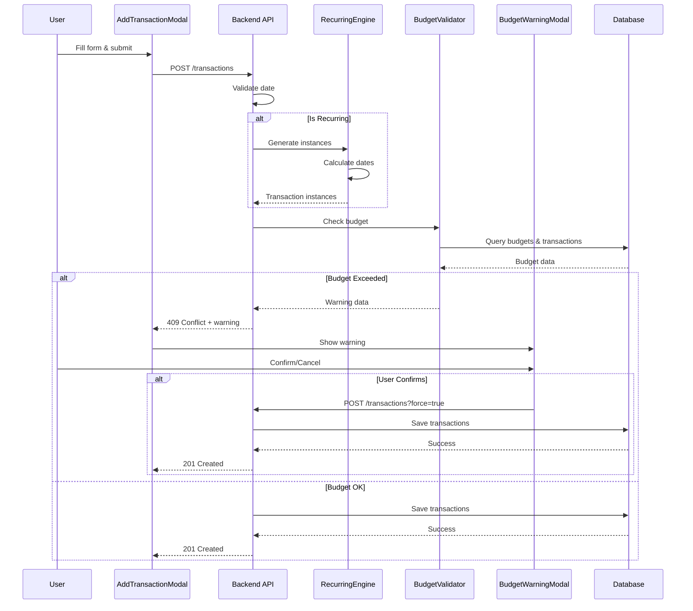

# Design Document: Budget Validation and Recurring Transactions

## Overview

This design document specifies the technical implementation for adding budget validation, future date validation, and recurring transactions functionality to the Sasha Finance application. The feature enhances the transaction creation workflow by:

1. **Budget Validation**: Preventing budget overruns by warning users when expenses exceed category budgets
2. **Date Validation**: Ensuring data integrity by restricting future dates for non-recurring transactions
3. **Recurring Transactions**: Automating the creation of regular income/expense transactions
4. **Enhanced UX**: Providing clear visual indicators and flexible deletion options for recurring transactions

The implementation follows the existing architecture patterns using React, TypeScript, Prisma, PostgreSQL, React Query, and Sonner for notifications.

## Architecture

### System Components



### Data Flow

#### Transaction Creation Flow
1. User fills out AddTransactionModal form
2. Frontend validates form inputs (required fields, positive amounts, valid dates)
3. If recurring checkbox is checked, frontend validates frequency and repetition count
4. Frontend sends POST request to `/api/transactions`
5. Backend DateValidator checks if date is in the future (unless recurring)
6. Backend processes transaction:
   - If non-recurring: Creates single transaction
   - If recurring: RecurringTransactionEngine generates multiple instances
7. For expense transactions, BudgetValidator checks budget limits
8. If budget exceeded, returns budget warning data to frontend
9. Frontend displays BudgetWarningModal if needed
10. User confirms or cancels
11. If confirmed, transaction(s) are saved to database
12. Frontend invalidates React Query cache and displays success toast

#### Budget Validation Flow
1. Transaction amount and date extracted
2. BudgetService queries for budget matching category, month, and year
3. If no budget exists, validation passes
4. If budget exists, calculate current spent amount for that category/month
5. Calculate new total: current spent + new transaction amount
6. If new total > budget limit, return warning data
7. Warning data includes: current spent, budget limit, new total, overage amount

#### Recurring Transaction Deletion Flow
1. User clicks delete on a recurring transaction
2. Frontend checks `isRecurring` flag
3. If recurring, displays DeleteConfirmationModal with two options
4. User selects delete option:
   - "Delete only this": DELETE `/api/transactions/:id`
   - "Delete this and future": DELETE `/api/transactions/:id?deleteFuture=true`
5. Backend processes deletion based on query parameter
6. Frontend invalidates cache and displays success toast

### Component Interaction



## Components and Interfaces

### Database Schema Changes

#### Transaction Model Extensions

```prisma
model Transaction {
  id                String   @id @default(uuid())
  amount            Float
  type              String   // "income" | "expense"
  description       String?
  date              DateTime
  categoryId        String
  userId            String
  receiptUrl        String?
  isRecurring       Boolean  @default(false)
  
  // NEW FIELDS for recurring transactions
  recurringGroupId  String?  // UUID shared by all instances in a recurring group
  frequency         String?  // "daily" | "weekly" | "monthly" | "yearly"
  originalStartDate DateTime? // The original start date of the recurring series
  sequenceNumber    Int?     // Position in the recurring series (1, 2, 3, ...)
  
  createdAt         DateTime @default(now())

  category Category @relation(fields: [categoryId], references: [id])
  user     User     @relation(fields: [userId], references: [id])
  
  @@index([userId, recurringGroupId]) // For efficient recurring group queries
  @@index([userId, date]) // For date-based queries
}
```

**Field Descriptions:**
- `recurringGroupId`: UUID that links all transaction instances created from the same recurring transaction definition. NULL for non-recurring transactions.
- `frequency`: The recurrence pattern. NULL for non-recurring transactions. Values: "daily", "weekly", "monthly", "yearly"
- `originalStartDate`: The date of the first transaction in the recurring series. Used for calculating future dates and identifying the series start. NULL for non-recurring transactions.
- `sequenceNumber`: The position of this transaction in the recurring series (1-based index). NULL for non-recurring transactions.

**Migration Strategy:**
1. Add new fields as nullable to existing Transaction table
2. Create indexes for performance optimization
3. Existing transactions will have NULL values for new fields (non-recurring)

### Frontend Interfaces

#### Transaction Types

```typescript
// frontend/src/types/transaction.ts

export type TransactionType = 'income' | 'expense';

export type RecurringFrequency = 'daily' | 'weekly' | 'monthly' | 'yearly';

export interface Transaction {
  id: string;
  amount: number;
  type: TransactionType;
  description: string | null;
  date: string; // ISO 8601 date string
  categoryId: string;
  userId: string;
  receiptUrl: string | null;
  isRecurring: boolean;
  recurringGroupId: string | null;
  frequency: RecurringFrequency | null;
  originalStartDate: string | null;
  sequenceNumber: number | null;
  createdAt: string;
  category: {
    id: string;
    name: string;
    icon: string | null;
    color: string | null;
    type: TransactionType;
  };
}

export interface CreateTransactionRequest {
  description: string;
  amount: number;
  type: TransactionType;
  categoryId: string;
  date: string; // ISO 8601 date string
  isRecurring?: boolean;
  frequency?: RecurringFrequency;
  repetitionCount?: number;
}

export interface BudgetWarning {
  categoryId: string;
  categoryName: string;
  month: number;
  year: number;
  currentSpent: number;
  budgetLimit: number;
  newTotal: number;
  overage: number;
  affectedMonths?: Array<{
    month: number;
    year: number;
    overage: number;
  }>;
}

export interface DeleteRecurringOptions {
  deleteType: 'single' | 'future';
}
```

#### Budget Validation Response

```typescript
// frontend/src/types/budget.ts

export interface BudgetValidationResponse {
  success: boolean;
  warning?: BudgetWarning;
  requiresConfirmation: boolean;
}
```

### Backend Interfaces

#### Transaction Service Types

```typescript
// backend/src/modules/transaction/transaction.types.ts

import { z } from 'zod';

export const RecurringFrequencyEnum = z.enum(['daily', 'weekly', 'monthly', 'yearly']);

export const createTransactionSchema = z.object({
  amount: z.number().positive('Suma trebuie să fie pozitivă'),
  type: z.enum(['income', 'expense']),
  description: z.string().optional(),
  date: z.string().or(z.date()).transform((val) => new Date(val)),
  categoryId: z.string().uuid('ID categorie invalid'),
  receiptUrl: z.string().url().optional(),
  isRecurring: z.boolean().default(false),
  frequency: RecurringFrequencyEnum.optional(),
  repetitionCount: z.number().int().min(1).max(365).optional(),
}).refine(
  (data) => {
    // If isRecurring is true, frequency and repetitionCount are required
    if (data.isRecurring) {
      return data.frequency !== undefined && data.repetitionCount !== undefined;
    }
    return true;
  },
  {
    message: 'Frecvența și numărul de repetări sunt obligatorii pentru tranzacții recurente',
    path: ['isRecurring'],
  }
);

export type CreateTransactionInput = z.infer<typeof createTransactionSchema>;

export interface RecurringTransactionInstance {
  amount: number;
  type: 'income' | 'expense';
  description: string | undefined;
  date: Date;
  categoryId: string;
  userId: string;
  isRecurring: boolean;
  recurringGroupId: string;
  frequency: string;
  originalStartDate: Date;
  sequenceNumber: number;
}

export interface BudgetWarningData {
  categoryId: string;
  categoryName: string;
  month: number;
  year: number;
  currentSpent: number;
  budgetLimit: number;
  newTotal: number;
  overage: number;
  affectedMonths?: Array<{
    month: number;
    year: number;
    overage: number;
  }>;
}
```

## Data Models

### Transaction Data Model

```typescript
interface TransactionDataModel {
  // Core fields
  id: string;                    // UUID
  amount: number;                // Positive decimal
  type: 'income' | 'expense';    // Transaction type
  description: string | null;    // Optional description
  date: Date;                    // Transaction date
  categoryId: string;            // Foreign key to Category
  userId: string;                // Foreign key to User
  receiptUrl: string | null;     // Optional receipt image URL
  
  // Recurring fields
  isRecurring: boolean;          // Flag for recurring transactions
  recurringGroupId: string | null; // UUID linking recurring instances
  frequency: RecurringFrequency | null; // Recurrence pattern
  originalStartDate: Date | null; // Start date of recurring series
  sequenceNumber: number | null;  // Position in series (1-based)
  
  // Metadata
  createdAt: Date;               // Creation timestamp
  
  // Relations
  category: Category;            // Category details
  user: User;                    // User details
}
```

### Budget Data Model

```typescript
interface BudgetDataModel {
  id: string;                    // UUID
  month: number;                 // 1-12
  year: number;                  // e.g., 2024
  totalLimit: number;            // Total budget limit
  isTotal: boolean;              // true = total budget, false = category budgets
  userId: string;                // Foreign key to User
  createdAt: Date;               // Creation timestamp
  
  // Relations
  categories: BudgetCategory[];  // Category-specific limits
  user: User;                    // User details
}

interface BudgetCategory {
  id: string;                    // UUID
  budgetId: string;              // Foreign key to Budget
  categoryId: string;            // Foreign key to Category
  limitAmount: number;           // Category-specific limit
  createdAt: Date;               // Creation timestamp
  
  // Relations
  budget: Budget;                // Parent budget
  category: Category;            // Category details
}
```

### Recurring Transaction Group Model

A recurring transaction group is a logical collection of transaction instances that share the same `recurringGroupId`. The group is not a separate database entity but a conceptual model represented by:

```typescript
interface RecurringTransactionGroup {
  recurringGroupId: string;      // Shared UUID
  frequency: RecurringFrequency; // Recurrence pattern
  originalStartDate: Date;       // Series start date
  instances: Transaction[];      // All transactions in the group
  
  // Computed properties
  totalInstances: number;        // Count of instances
  firstInstance: Transaction;    // First transaction (sequenceNumber = 1)
  lastInstance: Transaction;     // Last transaction (highest sequenceNumber)
}
```

## Error Handling

### Error Types and Responses

#### Validation Errors

```typescript
// 400 Bad Request
interface ValidationError {
  status: 400;
  error: 'ValidationError';
  message: string;
  details: Array<{
    field: string;
    message: string;
  }>;
}

// Examples:
// - "Suma trebuie să fie pozitivă"
// - "Frecvența este obligatorie pentru tranzacții recurente"
// - "Numărul de repetări trebuie să fie între 1 și 365"
```

#### Date Validation Errors

```typescript
// 400 Bad Request
interface DateValidationError {
  status: 400;
  error: 'DateValidationError';
  message: 'Nu poți adăuga tranzacții cu date din viitor';
  date: string; // The invalid date
}
```

#### Budget Warning (Not an Error)

```typescript
// 409 Conflict (requires user confirmation)
interface BudgetWarningResponse {
  status: 409;
  error: 'BudgetExceeded';
  message: 'Tranzacția depășește bugetul categoriei';
  warning: BudgetWarningData;
  requiresConfirmation: true;
}
```

#### Database Errors

```typescript
// 500 Internal Server Error
interface DatabaseError {
  status: 500;
  error: 'DatabaseError';
  message: 'Eroare la crearea tranzacțiilor recurente';
  // Detailed error logged server-side, not exposed to client
}
```

#### Not Found Errors

```typescript
// 404 Not Found
interface NotFoundError {
  status: 404;
  error: 'NotFoundError';
  message: string; // e.g., "Transaction not found", "Budget not found"
}
```

### Error Handling Patterns

#### Frontend Error Handling

```typescript
// In React Query mutations
const createTransactionMutation = useMutation({
  mutationFn: (data: CreateTransactionRequest) => 
    transactionsService.create(data),
  onError: (error: AxiosError<any>) => {
    if (error.response?.status === 409) {
      // Budget warning - show modal
      setBudgetWarning(error.response.data.warning);
      setShowBudgetWarning(true);
    } else if (error.response?.status === 400) {
      // Validation error - show in form
      const validationError = error.response.data;
      if (validationError.details) {
        const formErrors: FormErrors = {};
        validationError.details.forEach((detail: any) => {
          formErrors[detail.field] = detail.message;
        });
        setErrors(formErrors);
      } else {
        toast.error(validationError.message);
      }
    } else if (error.response?.status === 500) {
      // Server error - show generic message
      toast.error('Eroare la crearea tranzacției. Te rugăm să încerci din nou.');
    } else {
      // Unknown error
      toast.error('A apărut o eroare neașteptată');
    }
  },
  onSuccess: () => {
    toast.success('Tranzacție adăugată cu succes!');
    queryClient.invalidateQueries({ queryKey: ['transactions'] });
    onClose();
  },
});
```

#### Backend Error Handling

```typescript
// In transaction controller
try {
  // Validate date
  if (!isRecurring && isFutureDate(date)) {
    throw new DateValidationError('Nu poți adăuga tranzacții cu date din viitor');
  }
  
  // Check budget
  if (type === 'expense') {
    const budgetWarning = await BudgetValidator.check(userId, categoryId, amount, date);
    if (budgetWarning && !forceCreate) {
      return res.status(409).json({
        error: 'BudgetExceeded',
        message: 'Tranzacția depășește bugetul categoriei',
        warning: budgetWarning,
        requiresConfirmation: true,
      });
    }
  }
  
  // Create transaction(s)
  const transactions = isRecurring
    ? await RecurringTransactionEngine.generate(data)
    : [await TransactionService.create(data)];
  
  return res.status(201).json({ data: transactions });
  
} catch (error) {
  if (error instanceof DateValidationError) {
    return res.status(400).json({
      error: 'DateValidationError',
      message: error.message,
    });
  }
  
  if (error instanceof ValidationError) {
    return res.status(400).json({
      error: 'ValidationError',
      message: error.message,
      details: error.details,
    });
  }
  
  // Log detailed error for debugging
  logger.error('Transaction creation failed', { error, userId, data });
  
  return res.status(500).json({
    error: 'DatabaseError',
    message: 'Eroare la crearea tranzacției',
  });
}
```

### Rollback Strategy

For recurring transaction creation, use database transactions to ensure atomicity:

```typescript
async function createRecurringTransactions(instances: RecurringTransactionInstance[]) {
  return await prisma.$transaction(async (tx) => {
    const created = [];
    
    for (const instance of instances) {
      const transaction = await tx.transaction.create({
        data: instance,
      });
      created.push(transaction);
    }
    
    return created;
  });
}
```

If any transaction creation fails, the entire batch is rolled back automatically by Prisma's transaction mechanism.

## Testing Strategy

### Unit Tests

#### Backend Unit Tests

**Transaction Service Tests:**
- Test single transaction creation
- Test recurring transaction generation with different frequencies
- Test date calculation for monthly recurring (edge cases: Feb 29, month-end dates)
- Test date calculation for yearly recurring (leap year handling)
- Test validation errors (negative amounts, missing fields, invalid dates)
- Test future date validation (should reject for non-recurring, allow for recurring)

**Budget Validator Tests:**
- Test budget check with no budget (should pass)
- Test budget check with budget not exceeded (should pass)
- Test budget check with budget exceeded (should return warning)
- Test budget check for income transactions (should skip validation)
- Test budget check for recurring transactions (multiple months)

**Recurring Transaction Engine Tests:**
- Test daily frequency calculation (1 day increments)
- Test weekly frequency calculation (7 day increments)
- Test monthly frequency calculation (preserve day of month)
- Test monthly frequency with month-end dates (Jan 31 → Feb 28/29)
- Test yearly frequency calculation (preserve month and day)
- Test yearly frequency with leap year (Feb 29 → Feb 28 in non-leap years)
- Test sequence number assignment (1, 2, 3, ...)
- Test recurring group ID assignment (same for all instances)

**Date Validator Tests:**
- Test future date detection
- Test current date (should pass)
- Test past date (should pass)
- Test timezone handling

#### Frontend Unit Tests

**AddTransactionModal Tests:**
- Test form validation (required fields, positive amounts)
- Test recurring checkbox toggle (shows/hides frequency and repetition fields)
- Test frequency dropdown options
- Test repetition count validation (min 1, max 365)
- Test date validation error display
- Test budget warning modal trigger
- Test form reset on close

**BudgetWarningModal Tests:**
- Test budget data display (current spent, limit, new total, overage)
- Test confirm button action
- Test cancel button action
- Test multiple months display for recurring transactions

**DeleteConfirmationModal Tests:**
- Test recurring transaction detection
- Test single delete option
- Test future delete option
- Test non-recurring transaction (standard confirmation)

### Integration Tests

**Transaction Creation Flow:**
- Test end-to-end transaction creation (frontend → backend → database)
- Test recurring transaction creation with budget validation
- Test budget warning flow (reject → show modal → confirm → create)
- Test date validation rejection

**Transaction Deletion Flow:**
- Test single recurring transaction deletion
- Test future recurring transactions deletion
- Test non-recurring transaction deletion

**Budget Validation Flow:**
- Test budget check across multiple months for recurring transactions
- Test budget warning with multiple affected months

### Property-Based Testing Assessment

This feature is **NOT suitable for property-based testing** because:

1. **Infrastructure Integration**: The feature heavily relies on database operations, API calls, and UI interactions, which are better tested with integration tests and example-based unit tests.

2. **Business Logic Specificity**: Budget validation and recurring transaction logic involve specific business rules (e.g., "monthly recurring preserves day of month") that are better validated with concrete examples rather than universal properties.

3. **Side Effects**: Transaction creation has side effects (database writes, notifications) that don't fit the pure function model required for property-based testing.

4. **Configuration and State Management**: The feature involves UI state management, form validation, and modal interactions that are better tested with example-based tests and integration tests.

**Alternative Testing Approach:**
- **Unit tests** for date calculation logic with edge cases (Feb 29, month-end dates, leap years)
- **Integration tests** for end-to-end flows (transaction creation, budget validation, deletion)
- **Example-based tests** for budget validation scenarios
- **Snapshot tests** for UI components (modals, forms)
- **Mock-based tests** for service layer interactions

### Test Coverage Requirements

**Backend Coverage:**
- Transaction service: 90%+ coverage
- Budget validator: 95%+ coverage (critical business logic)
- Recurring transaction engine: 95%+ coverage (complex date calculations)
- Date validator: 100% coverage (simple but critical)

**Frontend Coverage:**
- AddTransactionModal: 85%+ coverage
- BudgetWarningModal: 85%+ coverage
- DeleteConfirmationModal: 85%+ coverage
- Transaction list components: 80%+ coverage

**Integration Test Coverage:**
- All user-facing workflows must have end-to-end tests
- Budget validation flow with multiple scenarios
- Recurring transaction creation with all frequencies
- Deletion flows for both recurring and non-recurring transactions

