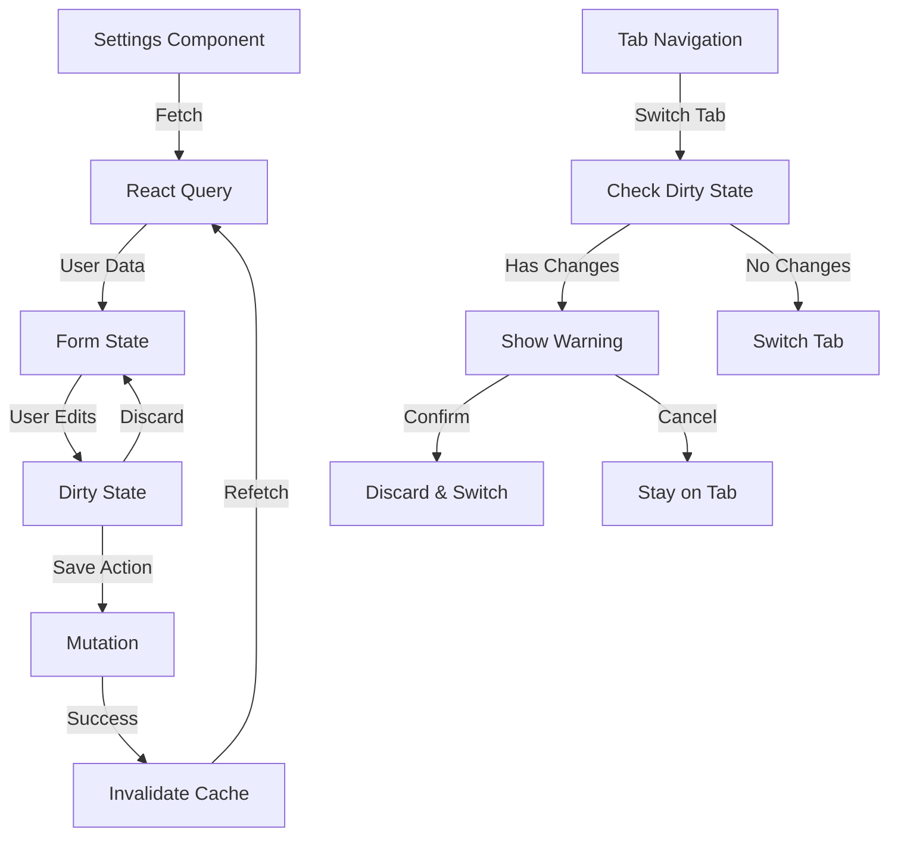

# Design Document: Settings Page Redesign

## Overview

The Settings Page Redesign transforms the existing single-page settings interface into a comprehensive, tabbed configuration center for the Sasha finance application. This redesign addresses user experience challenges by organizing settings into five logical sections (Profile, Security, Preferences, Notifications, Data & Privacy), implementing robust form state management with unsaved changes tracking, and providing enhanced visual feedback through the purple-accented design system (#7C5CFF).

### Key Design Goals

1. **Organized Information Architecture**: Group related settings into distinct tabs to reduce cognitive load and improve discoverability
2. **Enhanced User Experience**: Implement dirty state tracking, inline validation, and clear feedback mechanisms to prevent data loss and guide users
3. **Security-First Approach**: Provide comprehensive security controls including password management, 2FA preparation, and session management
4. **Data Sovereignty**: Enable users to export, import, and delete their data with appropriate safeguards
5. **Accessibility Compliance**: Follow WAI-ARIA patterns for tab navigation and form controls
6. **Design System Consistency**: Utilize established design tokens and component patterns from the Sasha brand identity

### Technical Approach

The implementation follows a component-based architecture using React with TypeScript, leveraging React Query for server state management, and implementing custom hooks for form state and dirty tracking. The design emphasizes progressive enhancement, responsive layouts, and keyboard accessibility while maintaining consistency with the existing application architecture.

## Architecture

### Component Hierarchy

```
Settings (Container)
├── TabNavigation
│   ├── TabButton (x5)
│   └── TabIndicator
├── UnsavedChangesBanner (conditional)
├── ProfileTab
│   ├── AvatarUpload
│   ├── ProfileForm
│   │   ├── Input (Prenume)
│   │   ├── Input (Nume)
│   │   ├── Input (Email - readonly)
│   │   └── Button (Save)
│   └── FormCard
├── SecurityTab
│   ├── PasswordChangeForm
│   │   ├── Input (Current Password)
│   │   ├── Input (New Password)
│   │   ├── PasswordStrengthIndicator
│   │   ├── Input (Confirm Password)
│   │   └── Button (Change Password)
│   ├── TwoFactorSection (disabled/coming soon)
│   └── ActiveSessionsList
│       └── SessionItem (x N)
├── PreferencesTab
│   ├── LanguageSelect
│   ├── CurrencySelect (searchable)
│   ├── DateFormatRadioGroup
│   ├── WeekStartRadioGroup
│   └── ThemeSelector (with previews)
├── NotificationsTab
│   ├── BudgetAlertsSection
│   │   ├── Toggle (Near Limit)
│   │   └── Toggle (Exceeded)
│   └── ReportsSection
│       ├── Toggle (Weekly)
│       └── Toggle (Monthly)
└── DataTab
    ├── ExportSection
    │   ├── Button (Export JSON)
    │   └── Button (Export CSV)
    ├── ImportSection
    │   └── Button (Import JSON)
    └── DangerZone
        ├── Button (Delete All Transactions)
        └── Button (Delete Account)
```

### State Management Strategy

**Server State (React Query)**
- User profile data (`/users/me`)
- Active sessions list (`/users/sessions`)
- Notification preferences (`/users/preferences`)
- Application settings

**Local State (React useState/useReducer)**
- Active tab index
- Form field values (per tab)
- Dirty state tracking (per form)
- Validation errors
- Modal visibility states
- Loading states

**Form State Management**
- Custom `useFormDirty` hook to track changes against initial values
- Per-tab dirty state to enable granular save operations
- Shallow comparison for object fields, deep comparison for nested structures

### Data Flow



## Components and Interfaces

### Core Components

#### 1. Settings Container

**Purpose**: Root component managing tab state, data fetching, and global settings context

**Props**: None (route-based component)

**State**:
```typescript
interface SettingsState {
  activeTab: TabId;
  dirtyTabs: Set<TabId>;
  showUnsavedBanner: boolean;
}

type TabId = 'profile' | 'security' | 'preferences' | 'notifications' | 'data';
```

**Key Responsibilities**:
- Fetch user data on mount
- Manage active tab state
- Track which tabs have unsaved changes
- Coordinate save/discard actions across tabs
- Handle tab switching with dirty state checks

#### 2. TabNavigation Component

**Purpose**: Accessible tab navigation following WAI-ARIA tab pattern

**Props**:
```typescript
interface TabNavigationProps {
  tabs: TabConfig[];
  activeTab: TabId;
  dirtyTabs: Set<TabId>;
  onTabChange: (tabId: TabId) => void;
}

interface TabConfig {
  id: TabId;
  label: string;
  icon?: React.ComponentType;
}
```

**ARIA Attributes**:
- `role="tablist"` on container
- `role="tab"` on each button
- `aria-selected="true"` on active tab
- `aria-controls` linking tab to panel
- `tabindex="-1"` on inactive tabs, `tabindex="0"` on active

**Keyboard Navigation**:
- Arrow Left/Right: Navigate between tabs
- Home/End: Jump to first/last tab
- Enter/Space: Activate focused tab

**Responsive Behavior**:
- Mobile (<768px): Horizontal scroll with snap points
- Tablet/Desktop: Full width with equal spacing

#### 3. AvatarUpload Component

**Purpose**: Profile picture upload with preview and removal

**Props**:
```typescript
interface AvatarUploadProps {
  currentUrl?: string;
  onUpload: (file: File) => Promise<void>;
  onRemove: () => Promise<void>;
  maxSizeMB: number;
}
```

**Features**:
- Circular 120px display
- Hover overlay with upload/remove buttons
- File validation (type, size)
- Loading state during upload
- Fallback to initials when no avatar

**Implementation Notes**:
- Use `<input type="file" accept="image/*">` hidden input
- Trigger via button click
- Client-side validation before upload
- Display preview using FileReader API
- Upload to backend, receive URL, update user profile

#### 4. PasswordStrengthIndicator Component

**Purpose**: Real-time visual feedback on password strength

**Props**:
```typescript
interface PasswordStrengthIndicatorProps {
  password: string;
  onStrengthChange?: (strength: PasswordStrength) => void;
}

type PasswordStrength = 'weak' | 'medium' | 'strong';
```

**Strength Calculation**:
```typescript
function calculateStrength(password: string): PasswordStrength {
  let score = 0;
  
  // Length scoring
  if (password.length >= 8) score += 1;
  if (password.length >= 12) score += 1;
  
  // Character variety
  if (/[a-z]/.test(password)) score += 1;
  if (/[A-Z]/.test(password)) score += 1;
  if (/[0-9]/.test(password)) score += 1;
  if (/[^a-zA-Z0-9]/.test(password)) score += 1;
  
  // Common patterns penalty
  if (/^(123|abc|qwerty)/i.test(password)) score -= 2;
  
  if (score <= 2) return 'weak';
  if (score <= 4) return 'medium';
  return 'strong';
}
```

**Visual Design**:
- Progress bar with three segments
- Color coding: Red (weak), Amber (medium), Green (strong)
- Text label below bar
- Smooth transitions between states

#### 5. UnsavedChangesBanner Component

**Purpose**: Persistent notification of unsaved changes with action buttons

**Props**:
```typescript
interface UnsavedChangesBannerProps {
  onSave: () => void;
  onDiscard: () => void;
  isSaving: boolean;
}
```

**Design**:
- Fixed position at top of settings content (below tab navigation)
- Subtle background color (bg-elevated with opacity)
- Left-aligned message: "Ai modificări nesalvate"
- Right-aligned action buttons: "Salvează" (primary) and "Renunță" (ghost)
- Slide-in animation on show, slide-out on hide

#### 6. ConfirmationModal Component

**Purpose**: Reusable modal for destructive action confirmation

**Props**:
```typescript
interface ConfirmationModalProps {
  isOpen: boolean;
  onClose: () => void;
  onConfirm: () => void;
  title: string;
  message: string;
  confirmText?: string;
  requireEmailConfirmation?: boolean;
  userEmail?: string;
  isDangerous?: boolean;
}
```

**Features**:
- Optional email confirmation input for high-risk actions
- Danger styling (red accent) when `isDangerous` is true
- Disabled confirm button until requirements met
- Escape key to close
- Focus trap within modal
- Backdrop click to close (with confirmation if email entered)

### Custom Hooks

#### useFormDirty Hook

**Purpose**: Track form dirty state by comparing current values to initial values

```typescript
interface UseFormDirtyOptions<T> {
  initialValues: T;
  currentValues: T;
  comparator?: (a: T, b: T) => boolean;
}

interface UseFormDirtyReturn {
  isDirty: boolean;
  dirtyFields: Set<keyof T>;
  reset: () => void;
  markClean: () => void;
}

function useFormDirty<T extends Record<string, any>>(
  options: UseFormDirtyOptions<T>
): UseFormDirtyReturn {
  const [initialValues, setInitialValues] = useState(options.initialValues);
  
  const isDirty = useMemo(() => {
    if (options.comparator) {
      return !options.comparator(initialValues, options.currentValues);
    }
    return !shallowEqual(initialValues, options.currentValues);
  }, [initialValues, options.currentValues, options.comparator]);
  
  const dirtyFields = useMemo(() => {
    const fields = new Set<keyof T>();
    Object.keys(options.currentValues).forEach(key => {
      if (initialValues[key] !== options.currentValues[key]) {
        fields.add(key as keyof T);
      }
    });
    return fields;
  }, [initialValues, options.currentValues]);
  
  const reset = useCallback(() => {
    setInitialValues(options.currentValues);
  }, [options.currentValues]);
  
  const markClean = useCallback(() => {
    setInitialValues(options.currentValues);
  }, [options.currentValues]);
  
  return { isDirty, dirtyFields, reset, markClean };
}
```

#### useTabNavigation Hook

**Purpose**: Manage tab state with keyboard navigation and dirty state checks

```typescript
interface UseTabNavigationOptions {
  tabs: TabConfig[];
  defaultTab?: TabId;
  onBeforeTabChange?: (from: TabId, to: TabId) => boolean | Promise<boolean>;
}

interface UseTabNavigationReturn {
  activeTab: TabId;
  setActiveTab: (tabId: TabId) => void;
  handleKeyDown: (event: React.KeyboardEvent) => void;
  getTabProps: (tabId: TabId) => TabProps;
  getPanelProps: (tabId: TabId) => PanelProps;
}

function useTabNavigation(options: UseTabNavigationOptions): UseTabNavigationReturn {
  const [activeTab, setActiveTabState] = useState<TabId>(
    options.defaultTab || options.tabs[0].id
  );
  
  const setActiveTab = useCallback(async (tabId: TabId) => {
    if (options.onBeforeTabChange) {
      const canChange = await options.onBeforeTabChange(activeTab, tabId);
      if (!canChange) return;
    }
    setActiveTabState(tabId);
  }, [activeTab, options.onBeforeTabChange]);
  
  const handleKeyDown = useCallback((event: React.KeyboardEvent) => {
    const currentIndex = options.tabs.findIndex(t => t.id === activeTab);
    
    switch (event.key) {
      case 'ArrowLeft':
        event.preventDefault();
        const prevIndex = currentIndex > 0 ? currentIndex - 1 : options.tabs.length - 1;
        setActiveTab(options.tabs[prevIndex].id);
        break;
      case 'ArrowRight':
        event.preventDefault();
        const nextIndex = currentIndex < options.tabs.length - 1 ? currentIndex + 1 : 0;
        setActiveTab(options.tabs[nextIndex].id);
        break;
      case 'Home':
        event.preventDefault();
        setActiveTab(options.tabs[0].id);
        break;
      case 'End':
        event.preventDefault();
        setActiveTab(options.tabs[options.tabs.length - 1].id);
        break;
    }
  }, [activeTab, options.tabs, setActiveTab]);
  
  // Implementation of getTabProps and getPanelProps...
  
  return { activeTab, setActiveTab, handleKeyDown, getTabProps, getPanelProps };
}
```

## Data Models

### User Profile Model

```typescript
interface UserProfile {
  id: string;
  email: string;
  firstName: string;
  lastName: string;
  currency: string;
  avatarUrl?: string;
  createdAt: string;
  updatedAt: string;
}

interface ProfileUpdatePayload {
  firstName?: string;
  lastName?: string;
  currency?: string;
  avatarUrl?: string;
}
```

**Validation Rules**:
- `firstName`: min 2 characters, max 50 characters, trim whitespace
- `lastName`: min 2 characters, max 50 characters, trim whitespace
- `currency`: ISO 4217 currency code (3 characters)
- `avatarUrl`: valid URL or null

### Password Change Model

```typescript
interface PasswordChangePayload {
  oldPassword: string;
  newPassword: string;
}

interface PasswordChangeValidation {
  minLength: number; // 6
  requiresUppercase: boolean; // false (optional)
  requiresLowercase: boolean; // false (optional)
  requiresNumber: boolean; // false (optional)
  requiresSpecial: boolean; // false (optional)
}
```

### User Preferences Model

```typescript
interface UserPreferences {
  language: 'ro' | 'en' | 'ru';
  currency: string;
  dateFormat: 'DD.MM.YYYY' | 'MM/DD/YYYY' | 'YYYY-MM-DD';
  weekStartDay: 'monday' | 'sunday';
  theme: 'dark' | 'light' | 'system';
}

interface PreferencesUpdatePayload extends Partial<UserPreferences> {}
```

### Notification Settings Model

```typescript
interface NotificationSettings {
  budgetNearLimit: boolean;
  budgetExceeded: boolean;
  weeklyReport: boolean;
  monthlyReport: boolean;
}

interface NotificationUpdatePayload {
  type: keyof NotificationSettings;
  enabled: boolean;
}
```

### Active Session Model

```typescript
interface ActiveSession {
  id: string;
  userId: string;
  deviceName: string;
  browser: string;
  location: string;
  ipAddress: string;
  lastActive: string;
  isCurrent: boolean;
  createdAt: string;
}

interface SessionRevokePayload {
  sessionId: string;
}
```

### Data Export Model

```typescript
interface ExportRequest {
  format: 'json' | 'csv';
  includeTransactions: boolean;
  includeCategories: boolean;
  includeBudgets: boolean;
  includePreferences: boolean;
}

interface ExportResponse {
  filename: string;
  data: Blob;
  contentType: string;
}
```

### Data Import Model

```typescript
interface ImportRequest {
  file: File;
  overwriteExisting: boolean;
}

interface ImportValidation {
  isValid: boolean;
  errors: string[];
  summary: {
    transactionsCount: number;
    categoriesCount: number;
    budgetsCount: number;
  };
}

interface ImportResponse {
  success: boolean;
  imported: {
    transactions: number;
    categories: number;
    budgets: number;
  };
  errors: string[];
}
```

## Error Handling

### Error Categories

**1. Validation Errors**
- Client-side validation failures
- Display inline below affected field
- Prevent form submission
- Clear on field correction

**2. Network Errors**
- Connection timeout
- Server unreachable
- Display toast: "Eroare de conexiune. Verifică conexiunea la internet"
- Retry mechanism for critical operations

**3. Authentication Errors**
- Invalid credentials (password change)
- Session expired
- Display specific error message
- Redirect to login if session invalid

**4. Server Errors**
- 500 Internal Server Error
- Display toast: "Eroare de server. Încearcă din nou mai târziu"
- Log to console for debugging

**5. Business Logic Errors**
- Incorrect current password
- Email already in use
- Display specific error message from server
- Highlight affected field

### Error Handling Strategy

```typescript
interface ErrorHandler {
  handleValidationError(field: string, message: string): void;
  handleNetworkError(error: Error): void;
  handleAuthError(error: AuthError): void;
  handleServerError(error: ServerError): void;
  handleBusinessError(error: BusinessError): void;
}

class SettingsErrorHandler implements ErrorHandler {
  handleValidationError(field: string, message: string): void {
    // Set field-specific error state
    // Display inline error message
    // Disable submit button
  }
  
  handleNetworkError(error: Error): void {
    // Display toast notification
    // Log to console
    // Optionally retry
  }
  
  handleAuthError(error: AuthError): void {
    if (error.code === 'INVALID_PASSWORD') {
      // Display specific message
      // Highlight password field
    } else if (error.code === 'SESSION_EXPIRED') {
      // Redirect to login
      // Clear local storage
    }
  }
  
  handleServerError(error: ServerError): void {
    // Display generic error toast
    // Log full error to console
    // Report to error tracking service
  }
  
  handleBusinessError(error: BusinessError): void {
    // Display server-provided error message
    // Highlight affected field if applicable
  }
}
```

### Error Recovery

**Automatic Recovery**:
- Retry network requests (max 3 attempts with exponential backoff)
- Restore form state from localStorage on page reload
- Revalidate session on 401 errors

**User-Initiated Recovery**:
- "Try Again" button on error toasts
- "Refresh" option for stale data
- "Discard Changes" to reset form state

### Error Logging

```typescript
interface ErrorLog {
  timestamp: string;
  errorType: string;
  message: string;
  stack?: string;
  context: {
    component: string;
    action: string;
    userId?: string;
  };
}

function logError(error: Error, context: ErrorLog['context']): void {
  const errorLog: ErrorLog = {
    timestamp: new Date().toISOString(),
    errorType: error.name,
    message: error.message,
    stack: error.stack,
    context,
  };
  
  console.error('[Settings Error]', errorLog);
  
  // Send to error tracking service in production
  if (process.env.NODE_ENV === 'production') {
    // sendToErrorTracking(errorLog);
  }
}
```

## Testing Strategy

### Testing Approach

This feature involves primarily UI interactions, form state management, and integration with backend APIs. The testing strategy focuses on:

1. **Unit Tests**: Component logic, custom hooks, validation functions
2. **Integration Tests**: Form submission flows, API interactions, state management
3. **End-to-End Tests**: Complete user workflows across tabs
4. **Accessibility Tests**: ARIA compliance, keyboard navigation, screen reader support

**Property-Based Testing Assessment**: This feature is **NOT suitable** for property-based testing because:
- It's primarily UI rendering and user interaction logic
- Form validation has specific business rules rather than universal properties
- State management is deterministic based on user actions
- API interactions are integration points, not pure functions

Instead, we'll use **example-based unit tests** for specific scenarios and **integration tests** for workflows.

### Unit Testing

**Components to Test**:

1. **PasswordStrengthIndicator**
   - Test strength calculation for various password patterns
   - Test visual rendering for each strength level
   - Test color coding (weak=red, medium=amber, strong=green)

2. **AvatarUpload**
   - Test file validation (size, type)
   - Test upload success/failure handling
   - Test remove functionality
   - Test fallback to initials

3. **useFormDirty Hook**
   - Test dirty state detection
   - Test dirty fields tracking
   - Test reset functionality
   - Test mark clean functionality

4. **useTabNavigation Hook**
   - Test tab switching
   - Test keyboard navigation (arrows, home, end)
   - Test before-change callback
   - Test ARIA attribute generation

**Example Unit Tests**:

```typescript
describe('PasswordStrengthIndicator', () => {
  it('should show weak strength for short passwords', () => {
    const { getByText } = render(<PasswordStrengthIndicator password="abc" />);
    expect(getByText('Slabă')).toBeInTheDocument();
  });
  
  it('should show strong strength for complex passwords', () => {
    const { getByText } = render(
      <PasswordStrengthIndicator password="MyP@ssw0rd123!" />
    );
    expect(getByText('Puternică')).toBeInTheDocument();
  });
  
  it('should penalize common patterns', () => {
    const { getByText } = render(
      <PasswordStrengthIndicator password="123456789" />
    );
    expect(getByText('Slabă')).toBeInTheDocument();
  });
});

describe('useFormDirty', () => {
  it('should detect dirty state when values change', () => {
    const { result } = renderHook(() =>
      useFormDirty({
        initialValues: { name: 'John' },
        currentValues: { name: 'Jane' },
      })
    );
    expect(result.current.isDirty).toBe(true);
  });
  
  it('should track dirty fields', () => {
    const { result } = renderHook(() =>
      useFormDirty({
        initialValues: { firstName: 'John', lastName: 'Doe' },
        currentValues: { firstName: 'Jane', lastName: 'Doe' },
      })
    );
    expect(result.current.dirtyFields.has('firstName')).toBe(true);
    expect(result.current.dirtyFields.has('lastName')).toBe(false);
  });
});
```

### Integration Testing

**Workflows to Test**:

1. **Profile Update Flow**
   - Load user data
   - Modify fields
   - Verify dirty state
   - Submit form
   - Verify success toast
   - Verify data refetch

2. **Password Change Flow**
   - Enter current password
   - Enter new password
   - Verify strength indicator
   - Enter confirmation
   - Submit form
   - Verify success/error handling

3. **Tab Navigation with Dirty State**
   - Modify form in tab A
   - Attempt to switch to tab B
   - Verify warning (if implemented)
   - Verify unsaved changes banner

4. **Data Export Flow**
   - Click export button
   - Verify loading state
   - Verify file download

5. **Destructive Action Flow**
   - Click delete button
   - Verify confirmation modal
   - Enter email confirmation
   - Confirm deletion
   - Verify success handling

**Example Integration Tests**:

```typescript
describe('Profile Update Flow', () => {
  it('should update profile successfully', async () => {
    const { getByLabelText, getByText } = render(<Settings />);
    
    // Wait for data to load
    await waitFor(() => {
      expect(getByLabelText('Prenume')).toHaveValue('John');
    });
    
    // Modify field
    const firstNameInput = getByLabelText('Prenume');
    fireEvent.change(firstNameInput, { target: { value: 'Jane' } });
    
    // Verify dirty state
    expect(getByText('Ai modificări nesalvate')).toBeInTheDocument();
    
    // Submit form
    const saveButton = getByText('Salvează');
    fireEvent.click(saveButton);
    
    // Verify success
    await waitFor(() => {
      expect(getByText(/actualizat cu succes/i)).toBeInTheDocument();
    });
  });
});

describe('Password Change Flow', () => {
  it('should show error for incorrect current password', async () => {
    server.use(
      rest.patch('/api/users/me/password', (req, res, ctx) => {
        return res(
          ctx.status(400),
          ctx.json({ message: 'Parola curentă este incorectă' })
        );
      })
    );
    
    const { getByLabelText, getByText } = render(<Settings />);
    
    // Navigate to security tab
    fireEvent.click(getByText('Securitate'));
    
    // Fill password form
    fireEvent.change(getByLabelText('Parola Curentă'), {
      target: { value: 'wrongpassword' },
    });
    fireEvent.change(getByLabelText('Parola Nouă'), {
      target: { value: 'newpassword123' },
    });
    fireEvent.change(getByLabelText('Confirmă Parola Nouă'), {
      target: { value: 'newpassword123' },
    });
    
    // Submit
    fireEvent.click(getByText('Schimbă Parola'));
    
    // Verify error
    await waitFor(() => {
      expect(getByText('Parola curentă este incorectă')).toBeInTheDocument();
    });
  });
});
```

### End-to-End Testing

**User Scenarios**:

1. **Complete Settings Configuration**
   - User logs in
   - Navigates to settings
   - Updates profile information
   - Changes password
   - Configures preferences
   - Enables notifications
   - Exports data
   - Verifies all changes persist

2. **Unsaved Changes Protection**
   - User modifies form
   - Attempts to navigate away
   - Sees unsaved changes warning
   - Chooses to save or discard

3. **Account Deletion**
   - User navigates to Data tab
   - Clicks delete account
   - Enters email confirmation
   - Confirms deletion
   - Redirected to login

**Example E2E Test** (using Playwright):

```typescript
test('user can update profile and preferences', async ({ page }) => {
  // Login
  await page.goto('/login');
  await page.fill('[name="email"]', 'test@example.com');
  await page.fill('[name="password"]', 'password123');
  await page.click('button[type="submit"]');
  
  // Navigate to settings
  await page.click('text=Setări');
  await expect(page).toHaveURL('/settings');
  
  // Update profile
  await page.fill('[name="firstName"]', 'Updated');
  await page.click('text=Salvează');
  await expect(page.locator('text=actualizat cu succes')).toBeVisible();
  
  // Switch to preferences
  await page.click('text=Preferințe');
  await page.selectOption('[name="language"]', 'en');
  await page.click('text=Salvează');
  
  // Verify language changed
  await expect(page.locator('text=Settings')).toBeVisible();
});
```

### Accessibility Testing

**Manual Testing Checklist**:
- [ ] Tab navigation works with keyboard only
- [ ] All interactive elements are focusable
- [ ] Focus indicators are visible
- [ ] Screen reader announces tab changes
- [ ] Form errors are announced
- [ ] Modal focus trap works correctly
- [ ] Color contrast meets WCAG AA

**Automated Accessibility Tests**:

```typescript
describe('Accessibility', () => {
  it('should have no accessibility violations', async () => {
    const { container } = render(<Settings />);
    const results = await axe(container);
    expect(results).toHaveNoViolations();
  });
  
  it('should support keyboard navigation', () => {
    const { getByRole } = render(<Settings />);
    const tablist = getByRole('tablist');
    const tabs = within(tablist).getAllByRole('tab');
    
    // Focus first tab
    tabs[0].focus();
    expect(tabs[0]).toHaveFocus();
    
    // Press arrow right
    fireEvent.keyDown(tabs[0], { key: 'ArrowRight' });
    expect(tabs[1]).toHaveFocus();
  });
});
```

### Performance Testing

**Metrics to Monitor**:
- Initial render time
- Tab switch time
- Form submission time
- Data export time

**Performance Tests**:

```typescript
describe('Performance', () => {
  it('should render settings page within 500ms', async () => {
    const startTime = performance.now();
    render(<Settings />);
    const endTime = performance.now();
    expect(endTime - startTime).toBeLessThan(500);
  });
  
  it('should switch tabs within 100ms', async () => {
    const { getByText } = render(<Settings />);
    const startTime = performance.now();
    fireEvent.click(getByText('Securitate'));
    const endTime = performance.now();
    expect(endTime - startTime).toBeLessThan(100);
  });
});
```

### Test Coverage Goals

- **Unit Tests**: 80% code coverage
- **Integration Tests**: All critical user flows
- **E2E Tests**: 3-5 key scenarios
- **Accessibility Tests**: 100% WCAG AA compliance

### Testing Tools

- **Unit/Integration**: Jest + React Testing Library
- **E2E**: Playwright
- **Accessibility**: axe-core + manual testing
- **Performance**: Lighthouse + custom metrics

